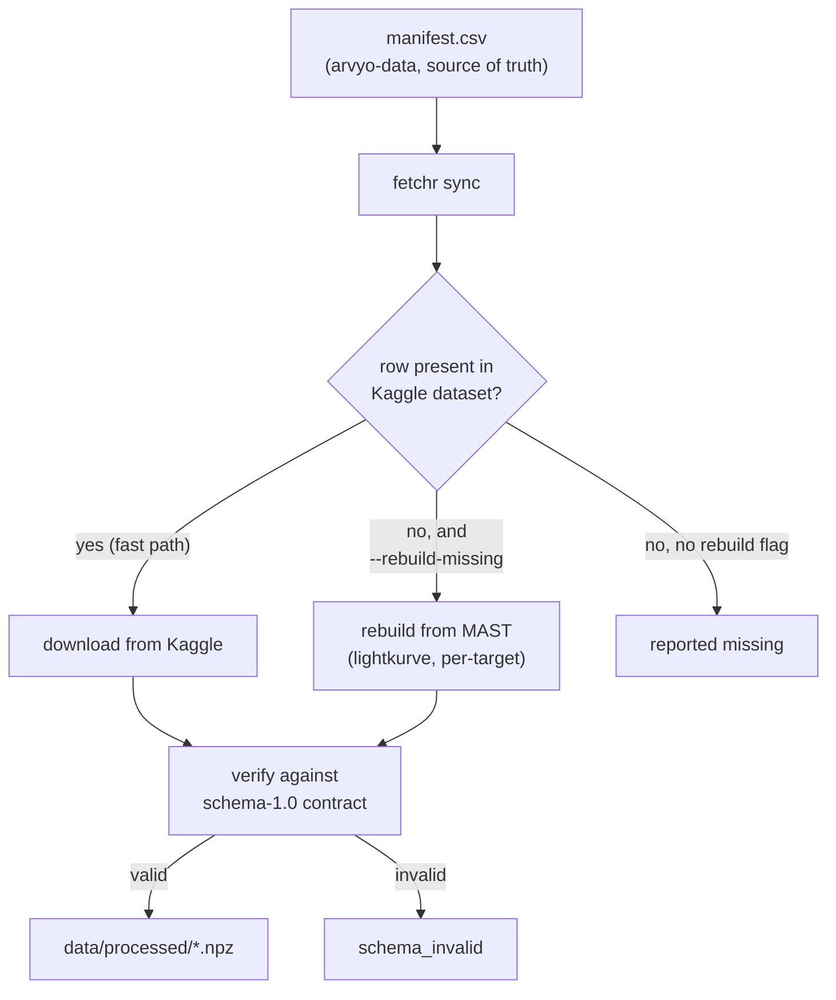
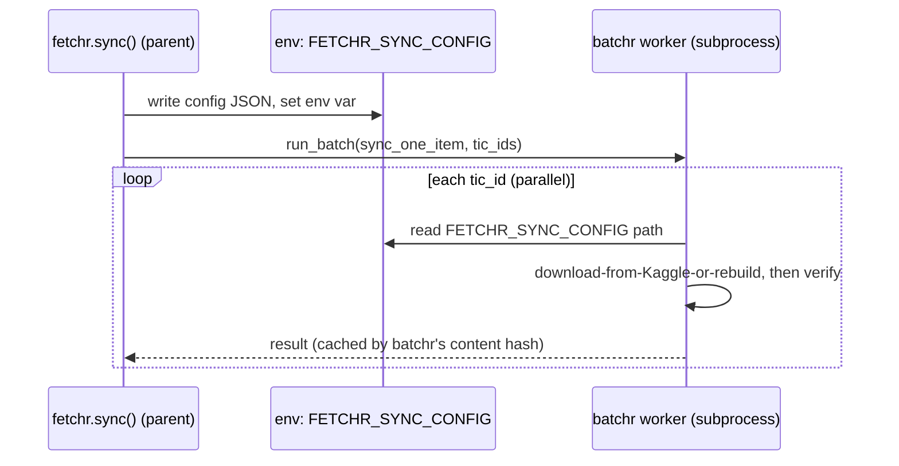

# fetchr

Reconstructs the full processed dataset (the `.npz` files
[`arvyo-data`](https://github.com/nikhilcherry/arvyo-data)'s `manifest.csv`
points at) on any machine, bridging the GitHub/Kaggle split: `arvyo-data`
ships code, manifest, schema, and small samples; the bulk `.npz` corpus
lives on Kaggle Datasets.

`fetchr` reads the manifest, pulls the bulk data from Kaggle as the fast
path, and falls back to re-deriving a target from MAST/lightkurve per-item
when a manifest row isn't in the Kaggle dataset (or Kaggle is unavailable)
-- verifying every file against `arvyo-pipeline`'s schema-1.0 contract as it
goes, so "the sync finished" and "the data is actually valid" are the same
claim.

`fetchr` is a standalone tool, but it has a real dependency on
[`batchr`](https://github.com/nikhilcherry/batchr) for the resumable,
parallel, crash-safe "run one function over many items" machinery, rather
than reimplementing it: `fetchr sync`'s per-row worker
(download-from-Kaggle-or-rebuild-then-verify) is exactly `batchr`'s job.



Every file `fetchr` writes has already passed the schema-1.0 check by the
time `sync` reports success — "the sync finished" and "the data is valid"
are the same claim, not two separate things you have to check.

## Install

```bash
pip install "fetchr[kaggle,rebuild] @ git+https://github.com/nikhilcherry/fetchr"
```

Or clone and install editable for development:

```bash
git clone https://github.com/nikhilcherry/fetchr
cd fetchr
pip install -e ".[kaggle,rebuild,dev]"
```

- **Base install** (`fetchr`): manifest I/O + offline `fetchr verify`. No
  Kaggle or MAST deps.
- **`fetchr[kaggle]`**: adds the `kaggle` package, for `fetchr sync`'s fast
  path. Needs a Kaggle API token at `~/.kaggle/kaggle.json` (see
  [Kaggle's API docs](https://www.kaggle.com/docs/api)).
- **`fetchr[rebuild]`**: adds `lightkurve`, `astropy`, and `wotan`, for the
  `--rebuild-missing` / `fetchr rebuild` MAST fallback path. `astropy` and
  `wotan` are pulled in alongside `lightkurve` because that path reuses
  `arvyo-data`'s own build scripts in-process (see `fetchr/mast_source.py`),
  and those scripts import them directly.

## CLI

```bash
fetchr verify --manifest arvyo-data/manifest.csv --data-dir data/processed/
# offline, contract-only check -- no Kaggle credentials, no network. This
# is the first thing anyone should run on a fresh machine to see what's
# missing.

fetchr sync --manifest arvyo-data/manifest.csv \
  --kaggle-dataset thecodecmonster/exoplanet-lightcurves-tess-kepler \
  --output-dir data/processed/ --workers 4
# --rebuild-missing falls back to a per-target MAST rebuild for manifest
# rows not present in the Kaggle dataset. --limit N syncs only the first N
# rows, for a quick test before a full run.

fetchr rebuild TIC_ID --output-dir data/processed/ --schema-version 1.0
# single-target MAST fallback -- used internally by --rebuild-missing, and
# directly for one-off gap-filling. Looks up label/period/epoch from
# --manifest (default ./manifest.csv) unless --label/--mission are given.
```

## Python API

```python
import fetchr

report = fetchr.sync(
    manifest_path="arvyo-data/manifest.csv",
    kaggle_dataset="thecodecmonster/exoplanet-lightcurves-tess-kepler",
    output_dir="data/processed/",
    workers=4,
    rebuild_missing=False,
)
print(report.summary())
# report.total, report.from_kaggle, report.from_mast, report.failed, report.wall_time_s

verify_report = fetchr.verify(
    manifest_path="arvyo-data/manifest.csv", data_dir="data/processed/",
)
# verify_report.present, verify_report.missing, verify_report.schema_invalid
#   -- each a list of tic_id
```

## How `sync` uses `batchr`

`batchr.run_batch(fn, items, ...)` only ever calls `fn(item)` with a single
item string -- there's no channel for extra config to reach `fn`, and `fn`
must be a plain, module-level, picklable function (no closures), since
workers are separate processes. `fetchr.sync()` therefore writes its
per-run configuration (the manifest rows, the Kaggle tic_id index,
`output_dir`, etc) to a small JSON file and points the module-level worker
(`fetchr._worker.sync_one_item`) at it via the `FETCHR_SYNC_CONFIG`
environment variable, set in the parent process just before calling
`run_batch`. See `fetchr/_worker.py`'s module docstring for the full
reasoning.



`ProcessPoolExecutor` workers inherit the parent's environment at
process-creation time (true for both the "fork" and "spawn" start
methods), so this works regardless of platform without any other
inter-process channel.

Resumability comes from `batchr` for free: item + worker source + a small
config dict (`output_dir`, `kaggle_dataset`, `rebuild_missing`) are hashed
into `batchr`'s cache key, so a `fetchr sync` interrupted mid-run and
re-run with the same arguments skips every row it already finished, and
only downloads/rebuilds the rest.

## Two judgment calls worth knowing about

**`fetchr/schema.py` copies, not imports, `arvyo-pipeline/arvyo/contract.py`'s
constants.** `fetchr` is meant to run standalone on a machine that may not
have a full `arvyo-pipeline` checkout (and pulling in its dependency stack
-- `torch`, `sbi`, `transitleastsquares`, ...  -- just to read six constants
would be a bad trade). This is the same manual-sync convention
`arvyo-pipeline`'s own README already documents ("any schema change
requires bumping `SCHEMA_VERSION` and updating BOTH repos' READMEs") --
`fetchr/schema.py` is now a third place that needs updating on a schema
bump.

**`fetchr/mast_source.py` reuses `arvyo-data`'s own build scripts, which
means the MAST fallback needs a real local `arvyo-data` checkout, not just
a copy of `manifest.csv`.** Those scripts have numeric-prefixed filenames
(`02_download_lightcurves.py`), which aren't valid Python module names for
a normal `import` statement, and `arvyo-data` isn't a pip-installable
package -- so `mast_source.py` loads them by file path
(`importlib.util.spec_from_file_location`) and calls their
`_search_and_download` / `preprocess_one` functions directly, instead of
reimplementing MAST search/download/detrending. This means a MAST-rebuilt
file can never silently diverge from what a full `arvyo-data` rebuild
would have produced. The checkout is located via `manifest_path`'s parent
directory by default (since the CLI examples always point `--manifest` at
a manifest.csv living inside an `arvyo-data` checkout), overridable with
`ARVYO_DATA_PATH` / `--arvyo-data-path` if the manifest was copied out on
its own.

## Non-goals (v1)

- No manifest generation or label derivation -- `manifest.csv` from
  `arvyo-data` is read-only input, the source of truth.
- No Kaggle dataset creation/upload -- `fetchr` assumes the named dataset
  already exists and is public.
- No full from-scratch dataset rebuild by default -- the MAST fallback is
  strictly per-row, opt-in via `--rebuild-missing` or `fetchr rebuild
  TIC_ID`, never automatic bulk MAST re-derivation.
- No vendoring -- `kaggle`/`lightkurve`/`astropy`/`wotan` stay pip
  dependencies behind optional extras.

## Known-unverified (as of this writing)

`arvyo-data`'s own README lists its Kaggle dataset as
`<placeholder -- Kaggle link TBD>` -- it isn't public yet. That means
`fetchr sync`'s Kaggle path and `fetchr rebuild`'s live MAST path
(verification steps 3, 4, and 6 in the original task handout) have not been
exercised against real Kaggle/MAST network calls, only against local
fixtures (see `tests/`). `kaggle_source.py` was written to be tolerant of
an unconfirmed dataset layout (see its module docstring) precisely because
of this -- run `fetchr sync` against the real dataset once it's public and
treat a `from_kaggle: 0` result as a signal to check `kaggle_source.py`'s
layout assumptions, not `batchr`.

## Dependencies

`batchr` (git dependency), `pandas`, `numpy`. Optional: `kaggle`
(`fetchr[kaggle]`), `lightkurve`/`astropy`/`wotan` (`fetchr[rebuild]`).

## License

MIT
